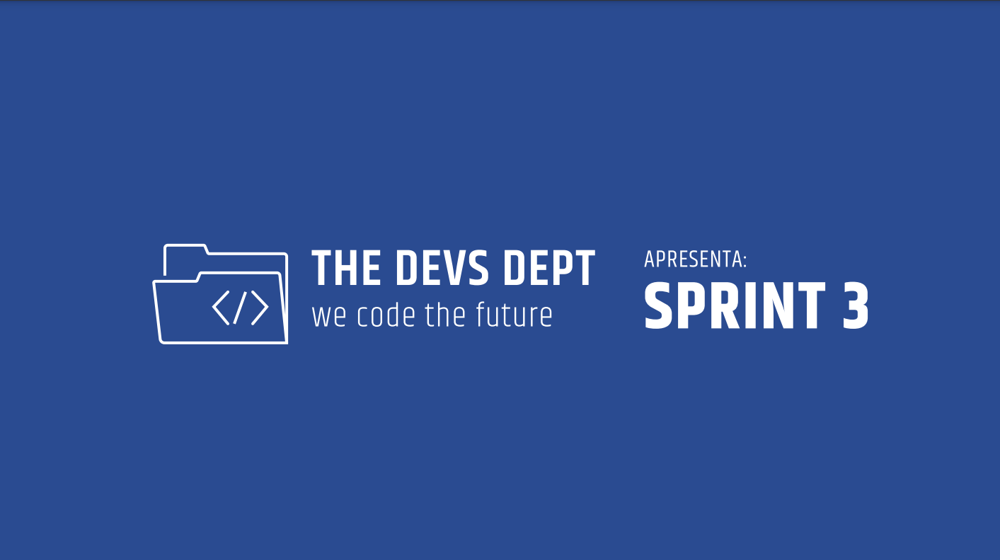
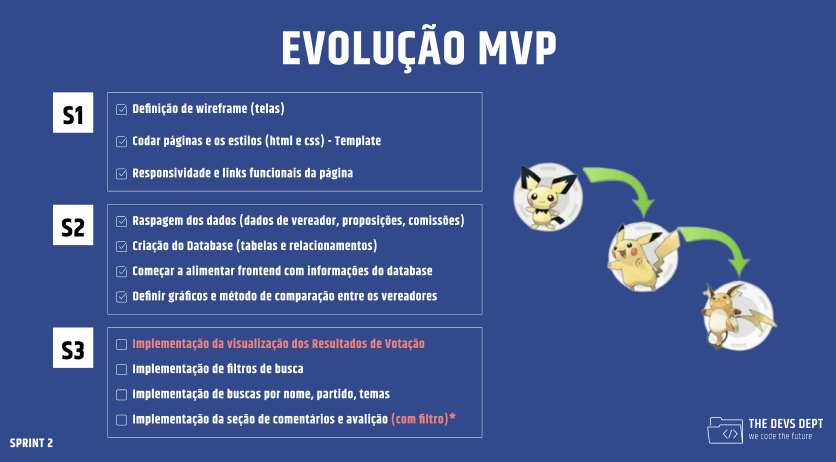

# **The Devs Department**  

Bem-vindo ao repositório oficial da **The Devs Department**! Este projeto foi desenvolvido como parte do trabalho de API do 1º Semestre de **DSM** na Fatec São José dos Campos.

> **Projeto SCRUM**: Foco em proatividade, autonomia, colaboração e entrega de resultados.

📌 **Nosso [contato](#autores)** está no final do README!  

---

## **📋 Índice**  
1. [Sobre o Projeto](#sobre-o-projeto)  
2. [Objetivos](#objetivos)  
3. [Cronograma das Sprints](#cronograma-das-sprints)  
4. [Funcionalidades](#funcionalidades)  
5. [Tecnologias Utilizadas](#tecnologias-utilizadas)  
6. [Backlog do Produto](#backlog-do-produto)  
7. [Equipe](#equipe)  
8. [Links Úteis](#links-úteis)  

---

## **📝 Sobre o Projeto**  

Imagine como seria útil ter um site para comparar a performance dos vereadores de São José dos Campos. Esse projeto transforma dados da prefeitura em informações interativas sobre:  

- **Proposições** realizadas.  
- **Assiduidade** e participação em comissões.  
- Avaliação do mandato pelos cidadãos.  

Com isso, incentivamos maior **transparência** e **engajamento cívico**.  

---

## **🎯 Objetivos**  

O projeto integra conhecimentos aprendidos em sala, incluindo:  
- Metodologia ágil **SCRUM**.  
- **Análise de requisitos**.  
- **Lógica de programação**.  
- **Design de interfaces**.  

---

## **🗓️ Cronograma das Sprints**  

| Sprint            | Previsão       | Status       |  
|--------------------|----------------|--------------|  
| **Kick Off**       | 02/09/2024     | ✅ Concluído  |  
| **Sprint 1**       | 29/09/2024     | ✅ Concluído  |  
| **Sprint 2**       | 27/10/2024     | ✅ Concluído  |  
| **Sprint 3**       | 24/11/2024     | 🔄 Em andamento |  
| **Feira de Soluções** | 12/12/2024   | ⏳ A fazer    |  

---

## **🚀 Funcionalidades**  

- Comparação interativa do desempenho dos vereadores.  
- Exibição de dados sobre proposições e assiduidade.  
- Avaliação pública do trabalho legislativo.  

**Demonstração:**  
  

---

## **💻 Tecnologias Utilizadas**  

### **Desenvolvimento:**  
- **Frontend:** HTML, CSS, Tailwind Framework, JavaScript  
- **Backend:** Flask, Python  
- **Banco de Dados:** Railway (Remoto)  

### **Ferramentas de Suporte:**  
- **Gestão:** Jira  
- **Design:** Figma  
- **Edição e Análise:** Microsoft Excel  
- **Ambiente:** Visual Studio Code, GitHub  

---

## **📊 Backlog do Produto**  

Você pode acessar o [PDF do backlog](misc/backlog.pdf) ou consultá-lo na pasta [misc](/misc) deste repositório.  

  

---

## **👥 Equipe**  

  

| Função           | Nome                  | Links                                                                                                                                      |  
|-------------------|-----------------------|--------------------------------------------------------------------------------------------------------------------------------------------|  
| **Product Owner** | Pedro Alves           | [LinkedIn](https://www.linkedin.com/in/pedro-alves-579a93140/) • [GitHub](https://github.com/pphvaz)                                       |  
| **Scrum Master**  | Nicoly Guedes         | [LinkedIn](https://www.linkedin.com/in/nicoly-guedes-dev/) • [GitHub](https://github.com/nicolygz)                                         |  
| **Dev Team**      | Guilherme Almeida     | [LinkedIn](https://www.linkedin.com/in/guilherme-almeida-profile/) • [GitHub](https://github.com/AlmdGuilherme)                            |  
| **Dev Team**      | Gustavo Almeida       | [LinkedIn](https://www.linkedin.com/in/gustavo-almeida-camargo/) • [GitHub](https://github.com/GustavoAC0802)                              |  
| **Dev Team**      | Pedro Martins         | [LinkedIn](https://www.linkedin.com/in/pedro-henrique-martins-55a0752a4/) • [GitHub](https://github.com/pedro-h-martins)                   |  
| **Dev Team**      | Otávio Vianna         | [LinkedIn](https://www.linkedin.com/in/ot%C3%A1vio-vianna-lima-1b26a932a/) • [GitHub](https://github.com/tuzzooz)                         |  
| **Dev Team**      | Tatiane Oliveira      | [LinkedIn](https://www.linkedin.com/in/tatiane-oliveira-a66789296/) • [GitHub](https://github.com/TatianeOliveira8)                        |  
| **Dev Team**      | Issami Umeoka         | [LinkedIn](https://www.linkedin.com/in/issami-umeoka-786716226/) • [GitHub](https://github.com/IssamiU)                                   |  
| **Dev Team**      | Tiago Freitas         | [LinkedIn](https://www.linkedin.com/in/tiago-freitas-74730b2a9/) • [GitHub](https://github.com/tiagow2)                                   |  

---

## **🔗 Links Úteis**  

- [Jira do Projeto](https://guedesdeabreunicoly.atlassian.net/jira/software/projects/SCRUM/boards/1)  
- [Vídeo Sprint 1](https://www.youtube.com/watch?v=Mvr1f5ndZ1o)  
- [Vídeo Sprint 2](https://www.youtube.com/watch?v=o4FedTRK9qg)
 - [Vídeo Sprint 3]()

---

Gostou do projeto? Não esqueça de dar uma ⭐ no repositório!  
