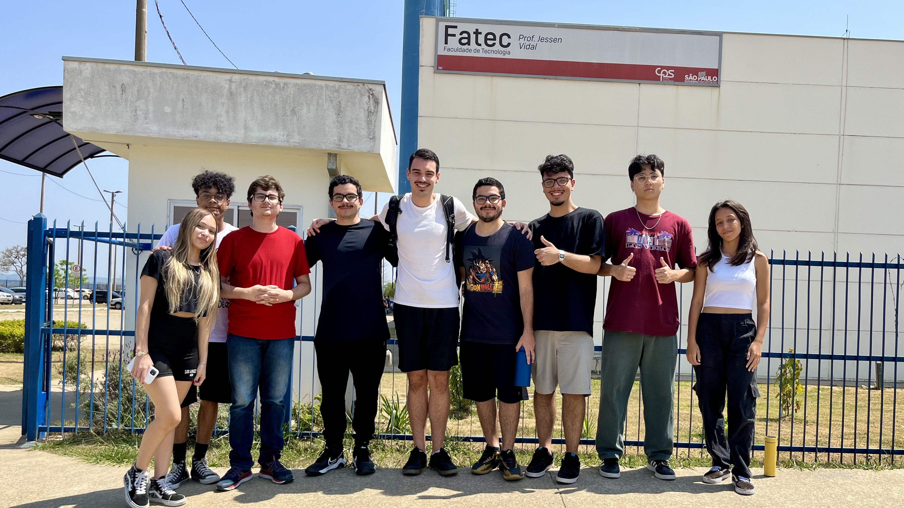

# The Devs Department

Bem-vindo ao projeto da THE DEVS DEPARTMENT! Este projeto foi desenvolvido como projeto de API do 1º Semestre de DSM da Fatec São José dos Campos.

#### Nosso [contato](#autores) está no final do ReadMe!

Projeto baseado na metodologia ágil SCRUM, procurando desenvolver a Proatividade, Autonomia, Colaboração e Entrega de Resultados dos estudantes envolvidos.

# Índice
* [Projeto](#projeto)
* [Cronograma das Sprints](#cronograma-de-sprints)
* [Objetivo do Projeto](#objetivo-do-projeto)
* [Funcionalidades e registros](#apresentação-das-funcionalidades)
* [Tecnologias utilizadas](#tecnologias-utilizadas)
* [Backlog do produto](#backlog-do-produto)
* [Burndown das Sprints](#burndown-das-sprints)
* [Apresentação da equipe](#apresentação-da-equipe-e-funções)
* [Entre em Contato!](#apresentação-da-equipe-e-funções)
* [Links Úteis](#links-úteis)

# Projeto

Imagine, como seria bom se houvesse um site que comparasse as performances dos nossos vereadores de São José dos Campos?  
Pois bem, esse projeto colhe os dados fornecidos pelo site da prefeitura a respeito das proposições, assiduidade, participação em comissões de cada vereador e de uma forma interativa, compara o seu mandato. Aliás, você pode ainda avaliar o trabalho do seu vereador!  

# Cronograma de Sprints
Sprint | Previsão | Status|
|------|--------|------|
|Kick Off | 02/09/2024 | concluido|
|01 | 29/09/2024 | concluido|
|02|  27/10/2024 | em progresso |
|03| 24/11/2024 | a fazer|
|Feira de Soluções| 12/12 |a fazer |

# Objetivo do Projeto

Esse projeto tem como objetivo colocar em prática os conhecimentos aprendidos em sala de aula, tais como metodologia Srum, análise de requisitos de clientes, lógica de programação, design de interface, entre muitas outras hard skills que estão visíveis no item [Tecnologias Utilizadas](#tecnologias-utilizadas).

# Apresentação das funcionalidades

Confira a seguir uma demonstração das funcionalidades:

 

# Tecnologias Utilizadas

**Tecnologias de Programação (hardskills)**
- Html
- CSS
- Flask
- Python
- Javascript  

**Softwares de Apoio** 
- Jira
- Figma
- Microsoft Excel
- Visual Studio Code (VSC)

# [Backlog Do Produto](misc/backlog.pdf) 
- [download](misc/backlog.pdf)

*encontra-se também na pasta [misc](/misc) desse repositório.*

# Burndown das sprints
!incluir print do jira (Nicoly)

# Apresentação da equipe e funções

|    Função     | Nome                                  |                                                                                                                                                      LinkedIn & GitHub                                                                                                                                                      |
| :-----------: | :------------------------------------ | :-------------------------------------------------------------------------------------------------------------------------------------------------------------------------------------------------------------------------------------------------------------------------------------------------------------------------: |
| Product Owner |   Pedro Alves         |                    |
| Scrum Master  | Nicoly |            |
| Dev Team   |Guilherme Almeida        |                  |
|  Dev Team  | Gustavo Almeida   |                                                        
|  Dev Team  | Pedro Martins              |               |
|  Dev Team  | Otavio Vianna|       |
|  Dev Team  | Tatiane Oliveira  |             |
|  Dev Team  | Issami Umeoka  |             |
|  Dev Team  | Tiago Freitas  |             |

# Links Úteis

- [Jira do Projeto](https://guedesdeabreunicoly.atlassian.net/jira/software/projects/SCRUM/boards/1)
- [Vídeo Apresentação - Sprint 1](youtube.com)
